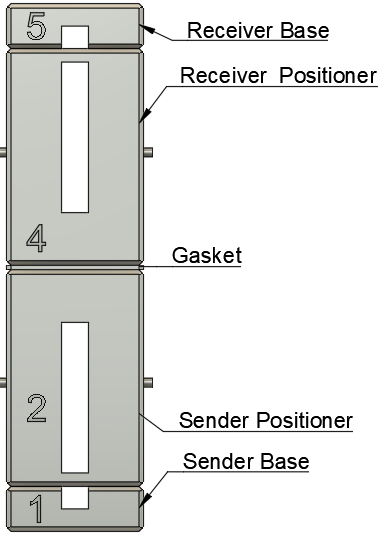

<noscript>

# Cartridge Transfer Instructions
These instructions will walk you through transfering from a dead or malfunctioning cartridge into a known good one. 

  

## Definitions
 | Name | Description | Part Number |
 |-----------|---------|-------------|
 | Receiving Tube | Empty cartridge that is known to have a working element | N/A | 
 | Sending Tube | Cartridge that is full but isn't working | N/A |
 | Receving Base | Screw holder for Receiving Tube. | No. 5 |
 | Sending Base | Screw holder for Sending Tube | No. 1 |
 | Receiving Positioner | Snap-fit block around Receiving Tube that aligns the flow channel. This is the one with holes to receive pins. | No. 4 |
 | Sending Positioner | Snap-fit block around Sending Tube that aligns the flow channel. This is the one with pins sticking out. | No. 2 |
 | Gasket | Flexible rubber seperater between Sending Positionier and Receiving Positioner. The side that has a bump sticking out goes into the Recieving Tube. | No. 3 |
 | Receiving Block | Collective term for Receiving Base + Receiving Tube + Recieving Positioner | N/A |
 | Sending Block | Collective term for Sending Base + Sending Tube + Sending Positioner | N/A |
 | Sock | Flexible rubber container to keep alignment and compression during transfer | No. 6 |

  

## Prerequsites
- Decide which Sending and Receiving Tubes for your configuration. See [Appendix](#supported-cartridge-types)
- Decide which Sock is appropriate for your configuration. See [Appendix](#sock-type)
- (Optional) Receiving Tube tested for continuity

  

## Tools and Supplies
- Cartridge Transfer Kit (tm)
- Paper towel
- Isopropol Alcohol

  

## Transfer Process
### Setup
1. Screw Receiving Tube into Receiving Base (No. 5) [image](./images/receiving-tube-base.jpg)
&nbsp;&nbsp;&nbsp;&nbsp;&nbsp;&nbsp; - Reminder: This is the tube that empty and known working
2. Screw Sending Tube into Sending Base (No. 1) [image](./images/sending-tube-base.jpg)

### Assemble Receiving Block
1. Carefully unscrew the mouthpiece from the cartridge. It may require careful plier application to the mouthpiece to loosen. 
&nbsp;&nbsp;&nbsp;&nbsp;&nbsp;&nbsp; - **DO NOT** hold glass with pliers or it will shatter. 
 &nbsp;&nbsp;&nbsp;&nbsp;&nbsp;&nbsp; - **Keep this mouthpiece. You will use it at the end to reassemble the cartridge**
&nbsp;&nbsp;&nbsp;&nbsp;&nbsp;&nbsp; - See Appendix for help unscrewing your particular model. See [Appendix](#supported-cartridge-types)
2. Keeping the part numbers facing the same direction, place the Receiving Positioner (No. 4) over the Receiving Tube until it seats against the Receiving Base (No. 5). You may hear a slight click as it snap-fits in place.
&nbsp;&nbsp;&nbsp;&nbsp;&nbsp;&nbsp; - To check alignment, the top of the cartridge screw should be in line with the top of the Receiving Positioner. [image](./images/receiving-tube-alignment.jpg)

### Assemble Sending Block
1. Carefully unscrew the mouthpiece from the cartridge. It may require careful plier application to the mouthpiece to loosen. 
&nbsp;&nbsp;&nbsp;&nbsp;&nbsp;&nbsp; - **DO NOT** hold glass with pliers or it will shatter. 
&nbsp;&nbsp;&nbsp;&nbsp;&nbsp;&nbsp;- See Appendix for help unscrewing your particular model. See [Appendix](#supported-cartridge-types)
2.  Keeping the part numbers facing the same direction, place the Sending Positioner (No. 2) over the Sending Tube until it seats against the Sending Base (No. 1). You may hear a slight click as it snap-fits in place.
&nbsp;&nbsp;&nbsp;&nbsp;&nbsp;&nbsp;- To check alignment, the top of the cartridge screw should be in line with the top of the Sending Positioner, excluding the pins. [image](./images/sending-tube-alignment.jpg)
3. Add Gasket over Sending Positioner pins, with the "button", the protruding bump on the gasket, facing away from the Sending Positioner and the same direction as the pins. 

### Complete Assembly
1. Place the Sending Block on a clean, flat surface.
2. Carefully position the Receiving Block over the Sending Block, aligning the holes in the Receiving Block with the pins in the Sending Block. Gasket should be positioned between these two blocks as they come together. **This should not result in any transfer yet**
3. Verify alignment. All printed part numbers must be ordered and facing the same direction. [image](./images/full-assembly-labeled.png)
4. Insert assembly into appropriate Sock. There should be a tight fit. [image](./images/mixed-transfer-assembly.jpg)
5. Verify assembly is secure and properly aligned. **This is the last chance to catch a problem before starting the transfer**

### Transfer
1. Rotate the assembly 180 degrees so that the numbers are all upside down and the assembly is still standing on end. [image](./images/upside-down.jpg)
2. Find a place where the assembly can stand veritically without disturbance and out of direct sunlight.
3. Wait 24hr.
4. Confirm transfer is complete. The windows cut into the blocks and sock allow you to hold it up to the light in case you're not sure.

### Unboxing
0. Do all these steps carefully and keep the assembly in the transfer position (upside down numbers).
1. Remove the Sock from the assembly
2. Remove the Sending Block from the top of the assembly. Be careful to not break the pins as you remove the Block. Place it Sanding Base down on a flat surface.
3. Gently remove the Sending Positioner from the Sending Base. 
4. Gently remove the Gasket from the Receiving Tube. The button is sometimes stuck in the Tube air hole and needs to be wiggled to free. 
5. Keeping the Receiving Base on a flat surface, remove the Receiving Positioner. 
6. Screw the mouthpiece onto the cartidge fully.
7. Unscrew the, now full, Receiving Tube from the Receiving Base.

  

## Cleaning
If you intend to reuse the assembly, it is important to clean it with isopropol alcohol after each use. The mating surfaces and insides of the Sending and Receiving Positioners as well as the Gasket are what need the most attention to remove residue. 

All parts *should* be dishwasher safe but are small and easily damaged so I take no responsibility for that cleaning method.

  

## General Disclaimer
This website is meant for informational purposes only. No responsibility is assumed in the use of the Cart Transfer assembly or instructiosn printed herein.

  

# Appendix
## Supported Cartridge Types
### Black Mouth Cartridge
The cartridges with the black mouth piece are generally shorter and must be used by the **Blue** assembly pieces. The black mouth pieces have internal rubber gaskets (rubber bands) on their internal screw parts. These must stay intact when used in a receiving tube or it will leak after transfer.

[black-assembled-with-base](./images/sending-tube-base.jpg)

[black-uncapped](./images/sending-tube-uncapped.jpg)

### Gold Mouth Cartridge
The cartridges with the gold mouth piece are generally longer and must be used by the **Yellow** assembly pieces. The gold mouth pieces have internal rubber gaskets (rubber bands) on their internal screw parts.  These must stay intact when used in a receiving tube or it will leak after transfer. Furthermore, they have a loose gasket at the end of the mouthpiece. When assembling the looser gasket, it must be oriented to set the narrow portion inside the glass tube. Screenshots to explain below

#### Gold cartridge assembed with base
[gold-assembled-with-base](./images/receiving-tube-base.jpg)
#### Gold cartridge correctly uncapped
[gold-uncapped](./images/receiving-tube-uncapped.jpg)
#### Gold cartridge loose gasket
[loose-gasket](./images/receive-tube-incorrect-gasket.jpg)
#### Gold cartridge exaggerated mouth piece assembly
[mouthpiece-drawing](./images/mouthpiece-with-gasket.jpg)

### Receiving vs Sending
The receiving cartridge is the empty one. It can be either Black or Gold type, it does not matter what the sending cartridge is. The sending cartridge is the one that is full and needs to be emptied. It also can be chosen independent of the receiving cartridge. Either cartridge can be used for receiving or sending and they do not need to match. 

[mixed-transfer-assembly](./images/mixed-transfer-assembly.jpg)

  

## Sock Type
The Sock is for adding compression to the assembly while waiting for it to drain. It is not absolutely required but makes clean up much easier. There are 3 Sock types provided, all labeled with Part No. 6: 
- Gold to Gold: Longest of the 3 for transfering from gold tube to gold tube
- Mixed transfer: Middle length of the 3 for transfering from one type to another
- Black to Black: Shortest of the 3 for transfering from black to black tube

[sock-line-up](./images/socks.jpg)

